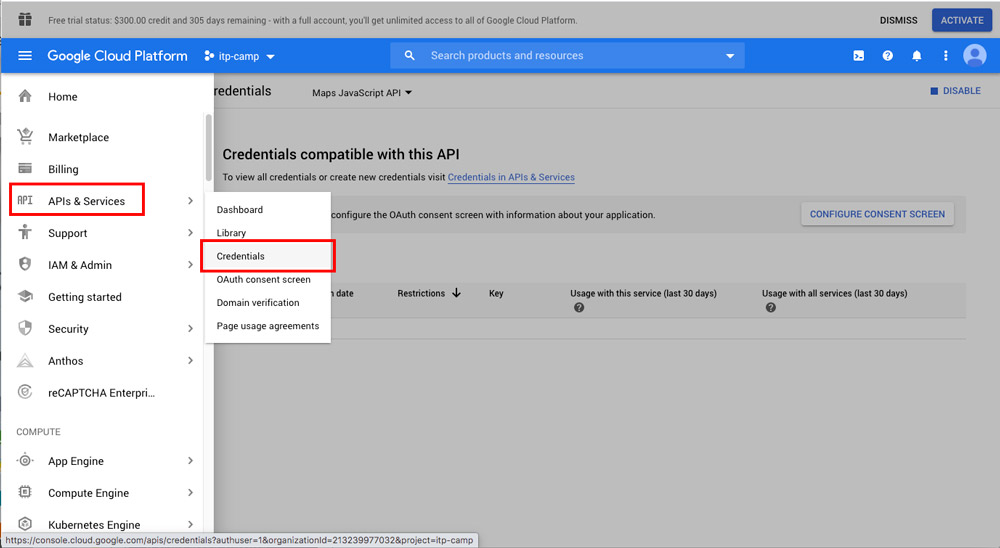
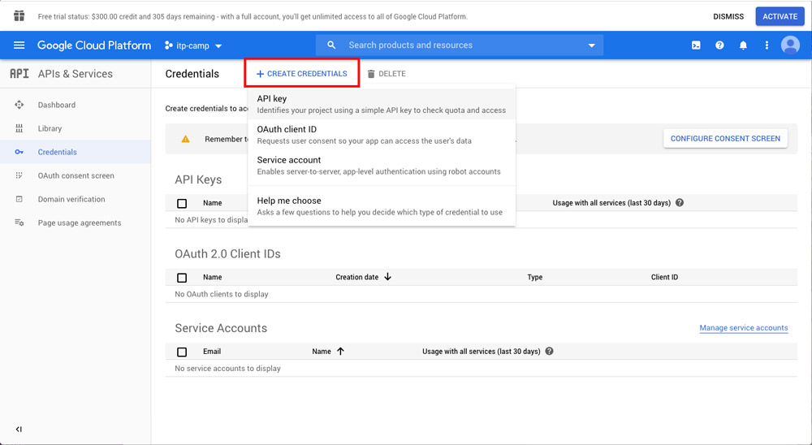
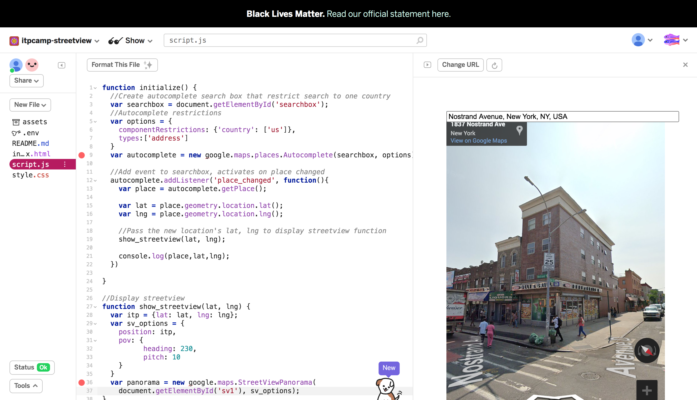

# Intro to Web Mapping (Part 2: Street View)
## 😎 Overview
In this workshop, we will expand the limits of web mapping by exploring the Google Street View API. When Google first began the Street View project, it was said to ["provide users with a rich, immersive browsing experience"](https://googlepress.blogspot.com/2007/05/google-announces-new-mapping_29.html). Over 10 years into its introduction, many artists, designers and researchers have used the platform creatively and critically — from captures of unexpected Street View images, virtual road trips, surveillance critique, to tracking gentrification.

This workshop aims to give participants basic toolkit to explore the capacity of Street View. We will be using Google Street View API, Glitch, HTML/CSS & JavaScript to build a web project comparing streets with the same name in two different cities or countries ([Project Reference](https://winnieyoe.com/Tracing-History-Through-Street-Names)).

The workshop takes place online through Zoom.

## Authors
Co-taught by [Winnie Yoe](https://winnieyoe.com) and [Karina Hyland](https://karinahy.com/).

## Outcomes & Goals
- Consider creative and critical use of Street View and satellite imageries
- Create a Google Street View API key
- Learn about fundamentals of using Google Street View in a web project
- Publish a web project using Glitch

## Workshop Schedule
Duration: 2 hours
- Context & Introduction
- [Project References](#project-references)
- Guided coding exercise - let's make a web map!
  - [Part 1: Google Maps APIs](#google-maps-APIs)
  - [Part 2: Make Web Map](#make-a-web-map)
- Project sharing
- (If time permits) Google Earth Studio Demo

---

## 🎈 Let's get started!
## Google Maps APIs
🤔 **What is an API?**
An analogy: API is the waiter, server/assets (in this case Google Maps) is the kitchen, and your webpage is the client. API is the messenger that will take your order, give it to the kitchen, and eventually send back your dish of fried rice.   

**🕵️ Part A: Let's find all the APIs we need!**
1. Go to [Google Cloud Platform](https://console.cloud.google.com/google/maps-apis/). *(You'll need a Google account)* Agree to the terms of service and set your country.


2. Click on New Project.


3. Make a new project and click `Create`.


4. On `APIs & Services` > `Dashboard`, click `Enable APIs and Services`. This will bring you to the API Library page.


5. We'll need 5 APIs enabled in total. Let's start by clicking/search `Places API`.


6. Enable the API


7. You should be able see the `Places API` in your enabled APIs. We'll also need `Street View Static API`, `Maps JavaScript API`, `Geocoding API` and `Geolocation API`. You can find click on one of them under `Additional APIs`.


**🗝 Part B: Let's get our own API key!**

8. Go to menu, click on `APIs & Services` > `Credentials`


9. Click on `Create Credentials` > `API key`


10. You've made an API key! We'll need that later, but for now click `Restrict Key`


11. Search for the APIs we've enabled earlier under `API Restrictions` > `Restrict key`. (`Street View Static API`, `Maps JavaScript API`, `Geocoding API`, `Geolocation API`)


12. Save when you have all five! You should see your API key under `API keys` with 5 restrictions now.


## Make a Web Map
1. Before we begin, let's see what the API key we got can really enable us to do. Copy this link in the browser and replace `YOUR_API_KEY`.

```
https://maps.googleapis.com/maps/api/streetview?size=400x400&location=47.5763831,-122.4211769&fov=80&heading=70&pitch=0&key=YOUR_API_KEY
```

2. Make a new web project on [Glitch](https://glitch.com/). Copy your API key from Google Cloud Platform after `key=`

In your `index.html` file:

```
  <script src="script.js"></script>
  <script async defer
      src="https://maps.googleapis.com/maps/api/js?key=YOUR_API_KEY&libraries=places&callback=init">
  </script>
```

```
  <div class="streetview" id="sv1"></div>
```

In your `style.css` file:

```
  html, body {
    height: 100%;
  }

  .streetview {
    height:100vh;
  }
```

In your `script.js` file:

```
  function init() {
    var itp = {lat: 40.6933, lng: -73.9874};
    var sv_options = {
      position: itp,
      pov: {
            heading: 230,
            pitch: 10
      }
    }
    var panorama = new google.maps.StreetViewPanorama(document.getElementById('sv1'), sv_options);
  }
```

This is where we would have met — new location of ITP in Brooklyn.

3. We want to be able to search for an address, let's create an autocomplete search box next.

In your `index.html` file (add this above the previous <div>):

```
  <div class="search">
      <input id="searchbox" type="text" placeholder="Search for a Street in the US">
  </div>
```

In your `script.js` file:
```
  var options = {
    componentRestrictions: {'country': ['us']},
    types:['address']
  }
  var autocomplete = new google.maps.places.Autocomplete(document.getElementById('searchbox'),options);
```

In your `style.css` file:
```
  #searchbox {
    z-index: 99;
    position: absolute;
    width: 50%;
    height: 30px;
    margin-top: 30%;
    left: 25%;
    text-align: center;
  }
```
4. We want to connect the search box to the map, let's create a separate function for the streetview.
Let's move things around a bit and create a new function for the streetview called `function show_streetview()`


5. Next, we'll need to add an event listener and pass on variables "lat, lng" to the function we created. Let's also add a console log to understand how the autocomplete done.



```
//Add event to searchbox, activates on place changed
  autocomplete.addListener('place_changed', function(){
    var place = autocomplete.getPlace();

    var lat = place.geometry.location.lat();
    var lng = place.geometry.location.lng();

    //Pass the new location's lat, lng to display streetview function
    show_streetview(lat, lng);

    console.log(place,lat,lng);
  })
```

6. Add another div for the country you'll be comparing streetviews

In you `index.html` file:

```
  <div class="streetviews">
      <div class="streetview" id="sv1"></div>
      <div class="streetview" id="sv2"></div>
  </div>
```

In your `style.css` file:

```
  .streetviews {
    display: flex;
  }

  .streetview {
    height:100vh;
    width: 50%;
    border: 1px solid black;
  }

```

7. We want to get the street name we input in country 1 > find if there's a same one in country 2.
From the console.log we see that the street name is stored in `place.address_components[0].long_name`.


Let's create a variable `var current_street = place.address_components[0].long_name;` and add this to the end of the autocomplete event listener.

```
  autocomplete.addListener('place_changed', function(){
     var place = autocomplete.getPlace();

     var lat = place.geometry.location.lat();
     var lng = place.geometry.location.lng();

     //Pass the new location's lat, lng to display streetview function
     show_streetview(lat, lng);

     //Pass street name in country 1 to country 2
     var current_street = place.address_components[0].long_name;
   })
```

8. We will need another function to control country 2's streetview (right panel), let's call the function `same_street`, add that after the `current_street` variable. We can check if the name gets pass on.

```
  function same_street(current_street){
    console.log(current_street)  
  }
```

9. We can add similar code as country 1 here:

```
function same_street(current_street){
  var sv_options = {
    position: {lat: lat, lng: lng}
    }
    new google.maps.StreetViewPanorama(document.getElementById('sv2'), sv_options);
}
```

10. Notice that `current_street` is a text while to display streetview, we need to use lat, lng. We need to convert the physical address using geocoding.

```
function same_street(current_street){
  var geocoder = new google.maps.Geocoder();

  geocoder.geocode(request, function(results, status){
  if (status === 'OK') {

    //DO SOMETHING

    } else {

      //TELL ME SOMETHING IS WRONG

    }
  })
}
```

11. We'll pass on `current_street` to request, if there is a result, then use the result's lat lng to show a new streetview, if not, send me an alert!

```
  function same_street(current_street) {
    var geocoder = new google.maps.Geocoder();

    var request = {
        'address': current_street,
        'componentRestrictions': {'country': 'HK'}
    }

    geocoder.geocode(request, function(results, status){
    if (status === 'OK') {
      console.log("results", results)
      var lat = results[0].geometry.location.lat();
      var lng = results[0].geometry.location.lng();

      var sv_options = {
      position: {lat: lat, lng: lng}
      }
      new google.maps.StreetViewPanorama(document.getElementById('sv2'), sv_options);

      } else {
        alert("No same streets found, please try a different entry.");
      }
    })
  }
```

**The complete code is here: https://glitch.com/~itpcamp-streetview**

---

## 🎉 Post Session Feedback & Resources
Please fill out the workshop feedback form

## Project References
**Street View Projects**
- ["Clinic"](http://www.lucamolnarart.com/2020/1/15/6b9hnl4likfbbyhtorazfuqguu317d), Luca Molnar
- ["Officer Involved"](https://theintercept.co/officer-involved/), Josh Begley
- ["A Series of Unfortunate Events"](https://www.lensculture.com/articles/michael-wolf-a-series-of-unfortunate-events), Michael Wolf
- ["Travel by Approximation: A Vitrual Road Trip"](https://www.lensculture.com/articles/michael-wolf-a-series-of-unfortunate-events), Jenny Odell
- ["Nine Eyes of Google Street View"](https://anthology.rhizome.org/9-eyes), Jon Rafman
- ["Deep mapping gentrification in a large Canadian city using deep learning and Google Street View"](https://journals.plos.org/plosone/article?id=10.1371/journal.pone.0212814), Lazar Ilic, M. Sawada, Amaury Zarzelli

**Street View Tool**
- [Street View Mapper](https://streetview-mapper.org/), Joey Lee

**Google Earth**
- ["Postcards from Goolge Earth"](http://clementvalla.com/work/postcards-from-google-earth/), Clement Valla
- ["How Universities Became the New Battlegrounds in  the Hong Kong Protests"](https://www.nytimes.com/interactive/2019/11/18/world/asia/hong-kong-protest-universities.html), NY Times

---

***Curriculum templates is inspired by [Eyebeam](https://github.com/eyebeam/curriculum/blob/master/TEMPLATE.md)***
